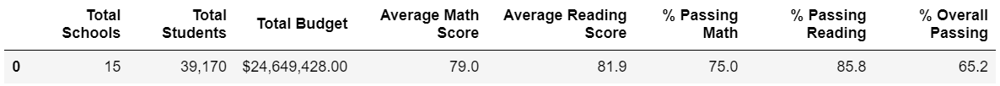
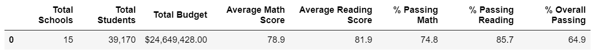
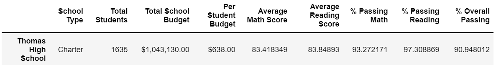
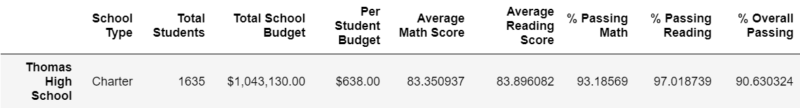
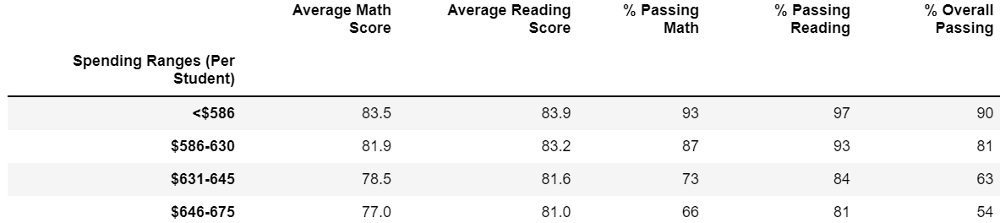
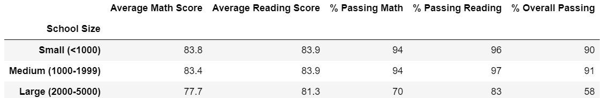
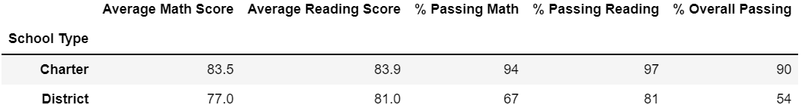

# School District Analysis
## Overview of the school district analysis
The school board supposes that Thomas High School ninth graders altered their grades in math and reading. The purpose of this analysis is to estimate reasonability of these suspicions. Maria asked me to replace suspicious grades with NaNs and repeat the school district analysis from the scratch. Below is the report on the changes in the results after 9th graders' results were eliminated from the dataset.
## Results (SEE DATA BELOW)
### How is the district summary affected?
Several metrics have declined:
- % Overall Passing
- % Passing Math
- % Passing Reading
- Average Math Score

### How is the school summary affected?
The same metrics have declined:
- % Overall Passing
- % Passing Math
- % Passing Reading
- Average Math Score

### How does replacing the ninth graders’ math and reading scores affect Thomas High School’s performance relative to the other schools?
THS lost:
- 2 ranks in % Passing Reading
- 2 ranks in Average Math Score

### How does replacing the ninth-grade scores affect the following:
- Math and reading scores by grade - not affected
- Math and reading scores by school spending - not affected
- Math and reading scores by school size - not affected
- Math and reading scores by school type - not affected

## Summary
All four changed metrics - % Overall Passing, % Passing Math, % Passing Reading, and Average Math Score - declined. In my opinion, the most dramatic change is the fact that THS lost 2 ranks in % Passing Reading and Average Math Score. It's hard to believe that eliminating results of only one grade out of four is able to worsen relative school performance that much. The above strengthen the academic dishonesty hypothesis. The fact that high-level snapshots haven't changed may give us a hint that supposed fraudsters were cautious enough not to draw too much attention to their endeavour.

### How is the district summary affected?
When|What
---|---
BEFORE:|
AFTER:|
### How is the school summary affected?
When|What
---|---
BEFORE:|
AFTER:|
### How does replacing the ninth graders’ math and reading scores affect Thomas High School’s performance relative to the other schools?
When|Av. Math Scr|% Passing Math|Av. Reading Scr|% Passing Reading|% Overall Passing
---|---|---|---|---|---
THS ranked BEFORE|4|7|5|1|2
THS ranked AFTER|6|7|5|3|2
### How does replacing the ninth-grade scores affect the following:
#### Math and reading scores by grade
Nothing changed:

When|Math 9th|Math 10th|Math 11th|Math 12th|
---|---|---|---|---
THS ranked BEFORE|3|7|5|4
THS ranked AFTER|NA|7|5|4

When|Reading 9th|Reading 10th|Reading 11th|Reading 12th|
---|---|---|---|---
THS ranked BEFORE|7|2|8|7
THS ranked AFTER|NA|2|8|7
#### Math and reading scores by school spending
Nothing changed:

#### Math and reading scores by school size
Nothing changed:

#### Math and reading scores by school type
Nothing changed:
